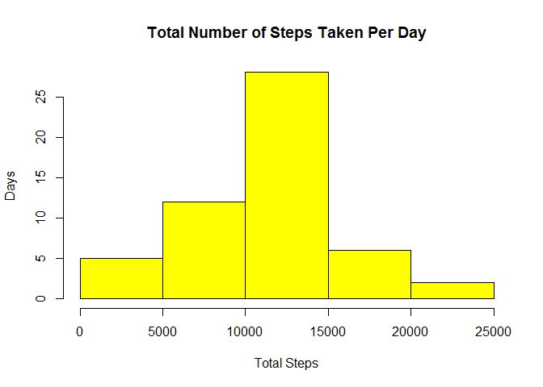
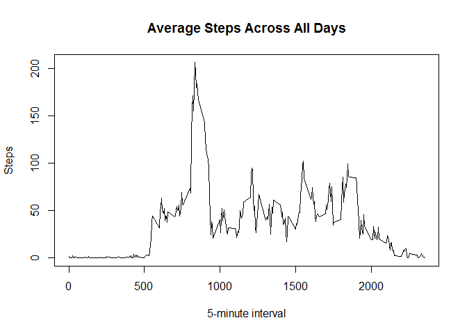
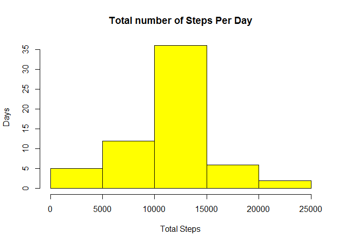
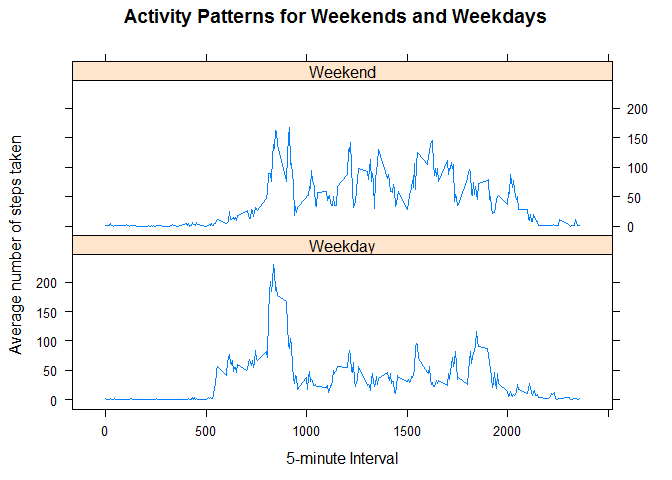

# Reproducible Research: Peer Assessment 1
#**Reproducible Research (Assignment 1)**


####**Loading and preprocessing the data**


```r
library(knitr)
library(ggplot2)

dataset <- read.csv("activity.csv")

total_steps <- aggregate(steps ~ date, data = dataset, sum ,na.rm = TRUE)
```

####**What is mean total number of steps taken per day?**

Calculate the total number of steps taken per day

```r
hist(total_steps[,2], xlab="Total Steps", ylab="Days", main = "Total Number of Steps Taken Per Day" ,col="yellow " )
```

 

Calculate and report the mean and median of the total number of steps taken per day

```r
steps_mean <- mean(total_steps$steps)
steps_median <- median(total_steps$steps)

print(sprintf("Mean of the total number of steps taken per day is %f ", steps_mean))
```

```
## [1] "Mean of the total number of steps taken per day is 10766.188679 "
```

```r
print(sprintf("Median of the total number of steps taken per day is %f ", steps_median))
```

```
## [1] "Median of the total number of steps taken per day is 10765.000000 "
```

####**What is the average daily activity pattern?**
Make a time series plot (i.e. type = "l") of the 5-minute interval (x-axis) and the average number of steps taken, averaged across all days (y-axis)

```r
steps_per_interval <- aggregate(steps ~ interval, data = dataset, mean, na.rm = TRUE)
plot(steps ~ interval, data=steps_per_interval, type= "l",
     xlab="5-minute interval",
     ylab = "Steps",
     main="Average Steps Across All Days")
```

 

Which 5-minute interval, on average across all the days in the dataset, contains the maximum number of steps?

```r
steps_per_interval[which.max(steps_per_interval$steps), ]
```

```
##     interval    steps
## 104      835 206.1698
```

```r
steps_per_interval[which.max(steps_per_interval$steps), ]$interval
```

```
## [1] 835
```

####**Imputing missing values**
Calculate and report the total number of missing values in the dataset (i.e. the total number of rows with NAs)

```r
missingVal <- sum(!complete.cases(dataset))

print(sprintf("Total number of missing value is %f ", missingVal))
```

```
## [1] "Total number of missing value is 2304.000000 "
```

Devise a strategy for filling in all of the missing values in the dataset.
Create a new dataset that is equal to the original dataset but with the missing data filled in.

```r
dataset_new <- dataset[!complete.cases(dataset) == TRUE,]
dataset_new[,1] <- steps_per_interval$steps

dataset_na <- rbind(dataset[complete.cases(dataset),], dataset_new)
```

Make a histogram of the total number of steps taken each day and Calculate and report the mean and median total number of steps taken per day.


```r
steps_per_day2 <- aggregate(steps ~ date, data = dataset_na, sum)

hist(steps_per_day2$steps, xlab="Total Steps", ylab="Days", main="Total number of Steps Per Day", col="yellow")
```

 

```r
NewHisMedian <- median(steps_per_day2$steps)
NewHisMean <- mean(steps_per_day2$steps)

print(sprintf("Mean of total number of steps is %f ", NewHisMean))
```

```
## [1] "Mean of total number of steps is 10766.188679 "
```

```r
print(sprintf("Median of total number of steps is %f ", NewHisMedian))
```

```
## [1] "Median of total number of steps is 10766.188679 "
```

Do these values differ from the estimates from the first part of the assignment? What is the impact of imputing missing data on the estimates of the total daily number of steps?
  weekend day.

    Median value is higher after imputing missing values. This is because the data file having some days with na value for steps and interval and was defaulted to 0. Therefore it was removed from the histogram of total daily number of steps.


####**Are there differences in activity patterns between weekdays and weekends?**
Create a new factor variable in the dataset with two levels - "weekday" and "weekend" indicating whether a given date is a weekday or weekend day.


Make a panel plot containing a time series plot (i.e. type = "l") of the 5-minute interval (x-axis) and the average number of steps taken, averaged across all weekday days or weekend days (y-axis). 

```r
w_end_day_result <- aggregate(dataset_na$steps, 
                              by=list(interval=dataset_na$interval, 
                                      dataset_na$week_split), 
                              mean)

# Rename column name
names(w_end_day_result) <- c("interval", "week_split", "steps")

library(lattice)

xyplot(steps ~ interval | week_split, 
       w_end_day_result, type = "l", 
       layout = c(1,2), 
       xlab = "5-minute Interval", 
       ylab = "Average number of steps taken", 
       main = "Activity Patterns for Weekends and Weekdays")
```

 
